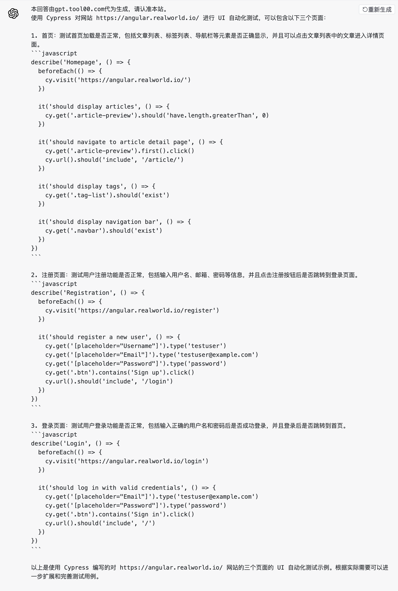

# 单元测试

## 概述

### 什么是单元测试

简单来说，单元测试是一种针对代码中最小的可测试单元（如函数、组件等）进行的自动化测试。通过编写一系列的测试用例，并确保程序在各种情况下都能够按照预期运行。

### 单元测试的目的

- 提高代码质量：通过编写和运行前端单元测试，我们能尽早发现和纠正代码中的错误和潜在问题，提高代码质量和稳定性。
- 确保功能正确性：前端单元测试能够验证每个单元的功能和行为是否按照预期工作，包括对输入的处理、算法的正确性等。
- 加速开发流程：通过自动化执行测试用例，前端单元测试可以快速验证代码修改的效果，减少手动测试的工作量，提高开发效率。
- 改善可维护性：编写和维护前端单元测试不仅帮助我们更好地理解和掌握代码，还为后续的代码重构和维护提供了保障。
- 支持持续集成：前端单元测试也是持续集成流程中的一部分，可以被集成到自动构建和部署流程中，实现快速反馈和持续质量保证。

### 常见的前端单元测试框架及优缺点

1. Jest：

   - 简介：Jest 是由 Facebook 开发的一个功能强大且易于使用的 JavaScript 测试框架。它集成了断言库、模拟和打桩功能，并提供了特定于 React、Vue 等前端框架的支持。
   - 优点：简单易用，内置了强大的功能（如快照测试、异步测试），提供了完整的测试环境，并且速度较快。
   - 缺点：对于复杂的配置和自定义需求可能会不够灵活。

2. Mocha：

   - 简介：Mocha 是一个灵活且可扩展的 JavaScript 测试框架，适用于浏览器和服务器环境。它不包含断言库，但可以与 Chai、Should.js 或 Expect.js 等断言库结合使用。
   - 优点：灵活，支持多种断言库和测试报告插件，提供了丰富的扩展能力。
   - 缺点：需要用户根据自己的需求进行配置和选择断言库。

3. Jasmine：

   - 简介：Jasmine 是一个功能强大的行为驱动的 JavaScript 测试框架，适用于前端和后端。它包含了内置的断言和测试运行环境。
   - 优点：易读易写，提供了完整的测试环境和语法，支持多种前端框架的集成。
   - 缺点：性能相对较慢，适合小型项目或简单的测试场景。

4. Enzyme：

   - 简介：Enzyme 是一个专为 React 应用编写测试的 JavaScript 测试工具。它提供了一组实用的 API，用于渲染、模拟事件和断言 React 组件的输出结果。
   - 优点：专注于 React 组件的测试，提供了易用的 API，并与其他断言库（如 Chai 和 Jest）兼容。
   - 缺点：对于非 React 应用或不纯粹的 JavaScript 函数测试的支持相对较弱。

## 基本原则和流程

### 基本原则

1. 独立性：每个单元测试应该是独立的，即每个测试用例都可以独立执行，并不依赖其他测试用例或外部环境。这样可以确保测试结果的准确性和可重复性，同时降低测试之间相互影响的风险。

2. 可重复性：每次运行单元测试，结果应该是一致的。通过确定性测试数据和可控的测试环境，保证测试的可重复性，即使测试在不同的环境或不同的时间运行，也能够得到相同的结果。

3. 全面性：尽可能覆盖所有代码路径和边界条件。考虑各种正常和异常的输入情况，测试边界值和边界情况，以确保代码在各种情况下都能正确地工作。保持高测试覆盖率，可以提高对代码质量的信心。

4. 可读性：编写清晰、可读且易于理解的测试代码是很重要的。测试代码应该具有良好的命名和注释，以便其他开发人员能够理解和维护测试。清晰的测试代码也能帮助开发人员更好地理解被测试代码的期望行为。

5. 及时性：尽早编写和运行单元测试。在开发新功能或修改现有代码时，立即编写相应的单元测试，以验证新代码的正确性。及时运行测试，并尽早发现和解决问题，可以大大减少问题的扩散和修复成本。

6. 可维护性：编写易于维护的单元测试是重要的。这意味着测试代码应该遵循良好的编码实践，包括模块化、重用性、可扩展性和可维护性。有时，重构测试代码也是必要的，以确保测试的可读性和可维护性。

### 流程

1. 编写测试用例：根据单元测试的目标和要求，编写测试用例。测试用例应该覆盖单元的不同功能和行为，包括正常输入、边界值和异常情况。

2. 设置测试环境：创建一个适当的测试环境，包括所需的测试数据、模拟对象和测试配置。确保测试环境的准备工作已经完成，以便进行测试。

3. 执行测试用例：使用选定的单元测试框架或工具，执行编写的测试用例。测试框架将运行测试并记录结果，包括通过的测试和失败的测试。

4. 验证结果：针对每个测试用例，验证实际结果是否与预期结果一致。这通常涉及使用断言来验证返回值、状态变化或其他预期结果。

5. 分析失败的测试：如果测试失败，仔细分析失败的原因。检查测试用例的输入数据、预期结果和实际输出是否一致，查找可能的代码错误或缺陷。

6. 修改和修复问题：如果发现了问题，修改代码以修复问题，并确保测试用例通过。重复执行测试用例，直到所有测试通过或问题解决。

7. 重复测试：确保测试用例的更新或修复未引入新的问题。全面运行测试套件，验证修改后的代码是否与其他组件和功能协调一致。

8. 测试覆盖率和报告：评估测试覆盖的范围和质量，确定是否需要增加额外的测试用例来提高覆盖率。生成测试报告以供团队参考和分析。

9. 持续集成：将单元测试集成到持续集成流程中，使它们自动执行。每次代码提交或构建过程中都运行单元测试，确保代码的稳定性和质量。

## 基本用法

### 匹配器

```javascript
test("two plus two is four", () => {
  expect(2 + 2).toBe(4);
});
```

- `toBe(value)`：用于检查结果是否等于预期值。
- `toEqual(value)`：用于递归检查对象或数组的值是否相等。
- `toMatch(regexp)`：用于检查字符串是否与正则表达式匹配。
- `toHaveLength(length)`：用于检查数组或字符串的长度是否等于预期长度。
- `toContain(item)`：用于检查数组或可迭代对象是否包含特定项。
- `toBeNull()`：用于检查结果是否为 null。
- `toBeTruthy()`：用于检查结果是否为真值。
- `toBeFalsy()`：用于检查结果是否为假值。
- `toThrow(error)`：用于检查函数是否抛出特定的错误。
- 等等...[更多文档](<(https://jestjs.io/zh-Hans/docs/expect)>)

### 异步代码

1. 回调函数：您可以使用回调函数来测试异步代码的结果。对于使用回调函数的异步操作，可以通过在测试函数中使用`done`参数来告知 Jest 等待测试完成。例如：

```javascript
test("异步函数使用回调函数", (done) => {
  fetchData((data) => {
    expect(data).toEqual("expected data");
    done();
  });
});
```

2. Promises：如果您的异步操作返回一个 Promise，您可以使用`.then`和`.catch`方法来处理结果和错误。在 Jest 中，您可以使用`.resolves`和`.rejects`匹配器来测试 Promise 的解析和拒绝。例如：

```javascript
test("异步函数返回Promise", () => {
  return expect(fetchData()).resolves.toEqual("expected data");
});
```

3. async/await：使用 async/await 语法可以使异步代码更加直观和易读。在测试函数前面添加`async`关键字，然后使用`await`关键字等待异步操作的结果。例如：

```javascript
test("异步函数使用async/await", async () => {
  const data = await fetchData();
  expect(data).toEqual("expected data");
});
```

### 模拟函数

1. 创建模拟函数

   - 使用`jest.fn()`来创建一个模拟函数，可以将其赋值给一个变量以供后续使用。

2. 模拟函数的行为

   - 设置返回值：可以使用`.mockReturnValue(value)`方法来设置模拟函数的返回值。
   - 设置抛出异常：可以使用`.mockRejectedValue(error)`方法来设置模拟函数在调用时抛出的异常。
   - 设置异步返回值：对于异步函数，可以使用`.mockResolvedValue(value)`或`.mockRejectedValue(error)`来设置模拟函数的异步返回值。

3. 断言模拟函数的调用

   - 调用次数：使用`.toHaveBeenCalledTimes(number)`断言模拟函数被调用的次数。
   - 参数：使用`.toHaveBeenCalledWith(arg1, arg2, ...)`断言模拟函数的参数列表。
   - 顺序：使用`.toHaveBeenNthCalledWith(callNumber, arg1, arg2, ...)`断言模拟函数的具体调用顺序和参数。

4. 清除模拟函数的状态

   - 重置模拟函数：使用`.mockReset()`方法可以重置模拟函数的状态，清除之前的所有调用信息。
   - 恢复模拟函数：使用`.mockRestore()`方法可以还原一个被模拟的函数为原始的实现。

5. 示例代码

```javascript
// 模拟一个函数
const fetchData = jest.fn();

// 设置模拟函数的返回值
fetchData.mockReturnValue({ name: "John", age: 30 });

// 断言模拟函数被调用一次
expect(fetchData).toHaveBeenCalledTimes(1);

// 断言模拟函数的参数
expect(fetchData).toHaveBeenCalledWith("https://api.example.com");

// 清除模拟函数的状态
fetchData.mockReset();

// 还原模拟函数
fetchData.mockRestore();
```

### 快照测试

Jest 快照测试是一种测试方法，用于验证代码输出的快照是否与预期一致。快照是一种当前代码输出的序列化表示，它是代码渲染的结果或数据结构的静态表示。在快照测试中，首次运行测试时，Jest 会将代码的快照保存下来，然后在后续运行测试时，会将当前渲染的快照与之前保存的快照进行对比验证，如果两者不一致，则会产生测试失败。

以下是使用 Jest 进行快照测试的基本步骤：

1. 创建快照测试案例文件：通常，每个被测试的组件或函数都应该有一个对应的快照测试案例文件。

2. 渲染代码并生成快照：在测试案例文件中，首先需要渲染被测试的组件或调用被测试的函数，并使用`.toMatchSnapshot()`方法生成当前代码的快照。

```javascript
import React from "react";
import renderer from "react-test-renderer";
import MyComponent from "../MyComponent";

test("MyComponent renders correctly", () => {
  const component = renderer.create(<MyComponent />);
  const tree = component.toJSON();
  expect(tree).toMatchSnapshot();
});
```

3. 执行快照测试：执行快照测试时，Jest 会将当前执行的快照与之前保存的快照进行比对。如果两者一致，则测试通过。如果两者不一致，则测试失败，Jest 会显示差异信息，并提供更新快照的选项。

4. 更新快照（可选）：如果代码有意的变更导致测试失败，可以选择更新快照。在测试失败时，Jest 会提供一个选项来更新快照文件，如果确定改动是正确的，可以选择更新快照文件，以便将新的快照作为标准。

快照测试可以用来验证组件的渲染结果、数据结构、HTML 标记等。它可以快速捕获 UI 变化和意外的更改，并及时提醒开发者进行检查和确认。

需要注意的是，快照测试并不适用于动态变化的场景，例如包含时间戳、随机数或浏览器相关信息的组件。在这种情况下，可以通过 mock 掉这些变化的部分，或者使用`.toMatchInlineSnapshot()`方法在测试用例中直接指定快照的预期值。

## 工程化实践

### 项目结构最佳实践

1. **按功能模块组织测试文件**：将相关的测试文件放在同一个目录下，可以按照功能模块或组件来组织。例如，如果你有一个`components`目录，那么你可以在`components`目录下创建一个`__tests__`目录，用于存放所有组件的测试文件。

2. **测试文件命名规则**：通常，测试文件的命名应与被测试的源文件保持一致，并添加`.test.js`或`.spec.js`后缀。例如，如果源文件名为`myComponent.js`，那么对应的测试文件名应为`myComponent.test.js`或`myComponent.spec.js`。

3. **使用`__mocks__`目录存放模拟文件**：Jest 允许我们创建一个名为`__mocks__`的目录，用于存放模拟文件。当我们在测试文件中调用`jest.mock('moduleName')`时，Jest 会自动查找`__mocks__`目录下的同名文件作为模块的模拟实现。

4. **集中管理 Jest 配置**：可以在项目的根目录下创建一个`jest.config.js`文件，用于集中管理 Jest 的配置。这样可以方便地修改和查看所有的 Jest 配置。

5. **使用`setupTests.js`文件进行测试环境的设置**：如果你需要在所有测试运行前进行一些设置，可以在`src`目录下创建一个`setupTests.js`文件。在这个文件中，你可以进行一些全局的设置，如全局变量的设置、模拟函数的实现等。

6. **使用`__snapshots__`目录存放快照文件**：当我们使用 Jest 的快照测试功能时，Jest 会自动在测试文件所在的目录下创建一个`__snapshots__`目录，用于存放生成的快照文件。

### 示例工程

1. [started](https://github.com/LingJinT/jest/tree/main/examples/getting-started)
2. [async](https://github.com/LingJinT/jest/tree/main/examples/async)
3. [snapshot](https://github.com/LingJinT/jest/tree/main/examples/snapshot)
4. [react](https://github.com/LingJinT/jest/tree/main/examples/react)
5. ...[more](https://github.com/LingJinT/jest/tree/main/examples)

## 测试覆盖率和持续集成

### 测试覆盖率

1. **配置 Jest**：在你的`jest.config.js`文件中，添加`collectCoverage`选项并设置为`true`。这将告诉 Jest 在运行测试时收集代码覆盖率信息。

```javascript
module.exports = {
  collectCoverage: true,
};
```

你还可以通过`collectCoverageFrom`选项来指定需要收集覆盖率信息的文件：

```javascript
module.exports = {
  collectCoverage: true,
  collectCoverageFrom: ["src/**/*.{js,jsx}"], // 只收集src目录下的.js和.jsx文件的覆盖率信息
};
```

2. **运行测试**：运行你的测试脚本，Jest 将自动收集代码覆盖率信息，并在测试完成后输出一个覆盖率报告。

```bash
npm run test
```

3. **查看覆盖率报告**：Jest 默认会在控制台输出一个文本格式的覆盖率报告。你也可以在`coverage`目录下找到更详细的 HTML 格式的覆盖率报告，只需在浏览器中打开`coverage/lcov-report/index.html`文件即可。

### 持续集成

在持续集成中，每次开发人员提交代码时，都会自动触发构建、测试和部署流程，以便尽早发现和解决问题，确保代码质量和稳定性。

要在项目中实现 Jest 的持续集成，可以遵循以下步骤：

1. **设置版本控制系统（例如 Git）：** 将你的项目代码托管在一个版本控制系统中，例如 Git。这将使你能够跟踪代码更改并协作开发。

2. **选择持续集成平台：** 选择一个持续集成平台，例如 Travis CI、Jenkins、CircleCI、GitHub Actions 等。这些平台提供了自动化构建、测试和部署的功能。

3. **配置持续集成流程：** 在所选的持续集成平台上，配置一个针对你的项目的持续集成流程。通常，这涉及到以下几个步骤：

   - **触发器设置：** 配置触发器，使每次代码提交到版本控制库时都会触发持续集成流程。

   - **环境设置：** 配置构建和测试所需的运行时环境，包括 Node.js 环境和依赖安装。

   - **构建步骤：** 在持续集成流程中添加构建步骤，例如安装项目依赖、运行测试等。

   - **测试命令：** 使用 Jest 提供的命令来运行你的测试套件。通常是类似于 `npm test` 或 `yarn test` 的命令。

   - **测试报告：** 配置持续集成平台以生成和展示测试报告，以便开发人员查看测试结果和覆盖率等信息。

4. **提交代码：** 将你的代码提交到版本控制系统中。这将触发持续集成平台自动运行构建和测试流程。

5. **监视持续集成结果：** 在持续集成平台上监视构建和测试的结果。如果有失败的测试，你会收到通知，并可以查看详细的错误信息。

6. **修复问题：** 如果测试失败，查找并修复代码中的问题。然后再次提交代码，持续集成平台将重新运行构建和测试流程。

7. **部署（可选）：** 如果所有测试通过，你可以配置持续集成平台以自动部署代码到生产环境或其他目标环境中。

需要注意的是，持续集成是一个广泛的主题，具体的配置和步骤可能因平台和项目而异。需要根据你的项目需求和所选的持续集成平台进行适当的配置。

## 拓展 - 集成测试、端到端测试

### 三者的区别

1. 单元测试（Unit Testing）：单元测试是对软件系统中最小的可测试单元进行测试，通常是针对一个函数、一个方法或一个类进行测试。它的目的是验证单元的功能是否正确，并且可以独立运行。单元测试通常使用模拟对象或桩对象来模拟依赖项，以隔离被测试单元的影响。单元测试的执行速度快，可以频繁运行，用于快速发现和修复代码中的问题。

2. 集成测试（Integration Testing）：集成测试是对软件系统中多个模块或组件进行测试，验证它们在集成后的功能和交互是否正常。集成测试的目的是检查各个模块之间的接口和依赖关系是否正确，以及整个系统是否按预期工作。集成测试可以验证系统的功能流程、数据传递和交互行为等。集成测试通常需要搭建测试环境，并模拟真实的数据和交互场景。

3. 端到端测试（End-to-End Testing）：端到端测试是对整个软件系统进行测试，从用户界面到后端数据库，模拟真实用户的操作流程，以验证整个系统的功能和性能。端到端测试的目的是验证系统在真实环境下的完整性和一致性。它可以检查用户界面的正确性、业务流程的可用性、数据的一致性等。端到端测试通常需要模拟用户的真实操作，并使用自动化工具或脚本来执行测试。

总结来说，单元测试关注单个模块的功能是否正确，集成测试关注模块之间的接口和依赖关系是否正确，端到端测试关注整个系统的功能和性能是否符合预期。这些测试方法在软件开发中相互补充，可以提高软件质量和稳定性。

### 其他常见工具及优缺点

1. Cypress：

   - 优点：简单易用，提供了丰富的 API 和调试能力，支持实时测试结果和交互式调试界面。
   - 缺点：只支持 Chrome 浏览器，对其他浏览器的支持较弱。

2. Puppeteer：

   - 优点：由 Google 开发，提供了强大的控制和操作 Chrome 浏览器的能力，支持生成页面截图和模拟用户操作。
   - 缺点：需要编写更多的代码来实现端到端测试的场景，不如其他工具简洁易用。

3. TestCafe：

   - 优点：跨浏览器支持，无需额外浏览器插件，可以在真实浏览器环境中执行测试。
   - 缺点：API 相对较简单，可能不够灵活，对于复杂的测试场景可能需要编写更多的代码。

4. Selenium：

   - 优点：广泛使用的自动化测试工具，支持多种编程语言和浏览器，具有强大的生态系统和社区支持。
   - 缺点：相对复杂，配置和维护成本较高，对于初学者可能有一定的学习曲线。

5. Playwright：
   - 优点：支持多种浏览器，包括 Chrome、Firefox 和 WebKit，提供简单易用的 API 和丰富的功能，支持并发执行测试。
   - 缺点：相对较新，生态系统和社区相对较小，可能缺少一些扩展和插件。

### Playwright 简介

Playwright 是一个用于自动化浏览器的工具，可以进行端到端测试。以下是 Playwright 的基本用法：

1. 导入 Playwright：在测试脚本中导入所需的浏览器引擎。

```javascript
const { chromium, firefox, webkit } = require("playwright");
```

2. 启动浏览器实例：选择一个浏览器引擎并启动一个浏览器实例。

```javascript
async function runTest() {
  const browser = await chromium.launch();
  const page = await browser.newPage();

  // 测试代码...

  await browser.close();
}

runTest();
```

3. 执行测试操作：使用浏览器实例进行各种测试操作，如导航到 URL、填写表单、点击按钮等。

```javascript
async function runTest() {
  const browser = await chromium.launch();
  const page = await browser.newPage();

  await page.goto("https://example.com");
  await page.fill('input[name="username"]', "testuser");
  await page.fill('input[name="password"]', "password");
  await page.click('button[type="submit"]');

  // 其他测试操作...

  await browser.close();
}

runTest();
```

4. 断言和验证：使用断言库或自定义验证逻辑来验证测试结果。

```javascript
const assert = require("assert");

async function runTest() {
  // ...

  const pageTitle = await page.title();
  assert.strictEqual(pageTitle, "Expected Page Title");

  // ...

  await browser.close();
}

runTest();
```

这只是 Playwright 的基本用法示例，你可以根据具体需求编写更复杂的测试脚本。Playwright 提供了丰富的 API 和功能，如截图、模拟用户操作、处理弹窗等，可以根据需要查阅官方文档和示例来深入了解和使用。

## 后续展望

### 功能上的展望

前端单元测试的展望是一个更加成熟和广泛应用的发展趋势。随着前端开发的重要性不断提升，前端单元测试将成为开发过程中不可或缺的一部分。

首先，前端单元测试将更加注重性能和可靠性。随着前端应用的复杂性增加，性能和可靠性变得越来越重要。前端单元测试将不仅仅关注功能的正确性，还会关注性能和可靠性方面的问题。例如，可以通过模拟网络延迟和 CPU 负载等方式来测试应用在不同环境下的性能表现。

另外，前端单元测试将更加注重集成和自动化。前端开发通常涉及到多个技术栈和组件的集成，因此前端单元测试需要考虑不同组件之间的交互和集成问题。未来，前端单元测试将更加注重集成测试，并提供更多的自动化测试工具和流程，以减少开发者的工作量和提高测试的覆盖率。

最后，前端单元测试将更加注重可视化和交互性。前端开发涉及到用户界面的设计和交互，因此前端单元测试需要能够模拟用户的操作和行为。未来，前端单元测试工具和框架将提供更多的可视化和交互性功能，以便开发者更好地测试用户界面的正确性和交互性。

总之，前端单元测试的展望是一个更加成熟和广泛应用的发展趋势，将注重性能、可靠性、集成和自动化，并提供更多的可视化和交互性功能。这将有助于提高前端开发的质量和效率。

### 效率上的展望

自动化测试脚本由 AI 自动生成


